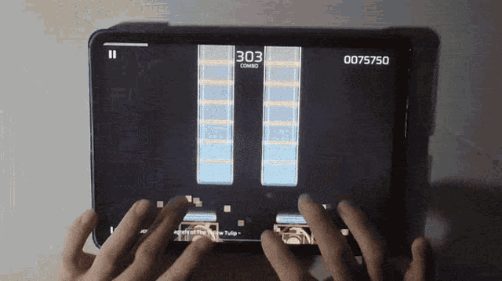
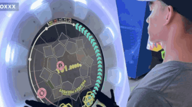

# Games to get better at **Rhythm games** 💢

The more _**you play**_, the _**better you get**_  anyway, so just play whatever, but here's my list. 

## **Taiko No Tatsujin**

In this game, you have to use sticks to hit the drums 🥁.  This game is really good for people who want to get better at polyrhythms and teaches fundamental rhythm recognition. 
Highly recommend for people who also want to learn the drums, as this is the rhythm game that is most similar to the actual instrument that it's based on. 

[Taiko No Tatsujin](https://taiko.namco-ch.net/taiko/en/index.php)

## Phigros

Phigros is a mobile rhythm game that is great for learning to sight-read. The game loves throwing random moves and always keeps you on your feet.  The game is 100% free, unlike most games here, so all you have to do is play the story to unlock all the songs.  The game is also really beginner-friendly with its lighter judgment.  

[Phigros (Play Store)](https://play.google.com/store/apps/details?id=com.PigeonGames.Phigros&hl=en_US)
[Phigros (App Store)](https://apps.apple.com/us/app/phigros/id1454809109S)

## Project Sekai: Colorful Stage

Project Sekai Colorful Stage 💮, also known as prosekai or PJSK, is extremely beginner-friendly and is especially a good start to the pipeline of harder rhythm games. While at first the game starts really easy, the game can get extremely difficult. The judgement is stricter than in a lot of other rhythm games, which makes it easier to play other rhythm games. 

[Project Sekai](https://colorfulstage.com/)

## maimai 

maimai is one of the main rhythm games that people play at the arcade scene (other than DDR).  Like the other ones, the entry to play maimai is really easy; however, the competitive scene is extremely hard. The average player of maimai can play every song in the game with high accuracy (over 95%). This game is really good if you want to learn how to read abnormal notes as well as overall rhythm, as it's extremely addictive 🎰.  It is also from SEGA, so there are a LOT of songs to choose from.  
[maimai](https://maimai.sega.com/)

## Osu! 

Osu! is one of, if not the most popular, rhythm games. The two most played modes, Standard and Mania, are really good for learning the basics of rhythm games and timing notes.  They are the baseline for rhythm games.  Standard is great for aim training (which can apply to shooters too!!!), and Mania is really good for people who want to learn how to tap at the right time, as the timing is strict. 🟣

[Osu!](https://osu.ppy.sh/)

